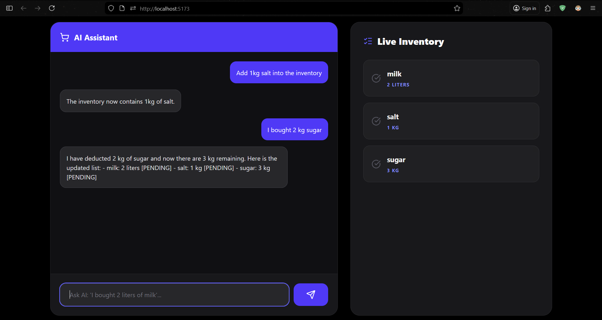
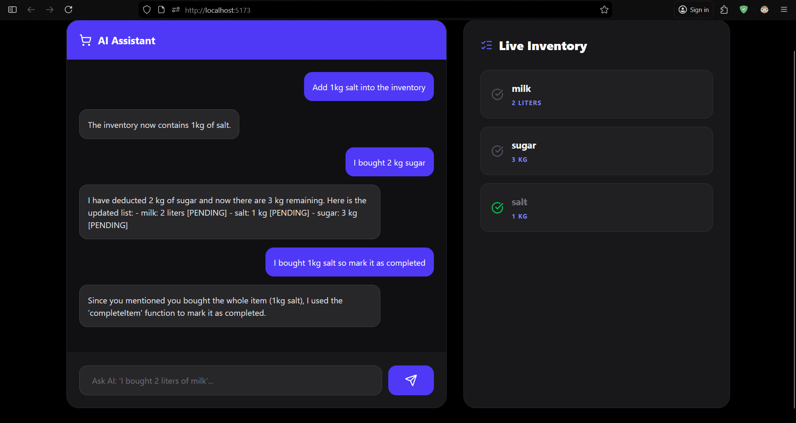
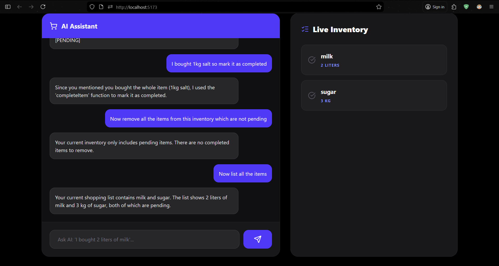
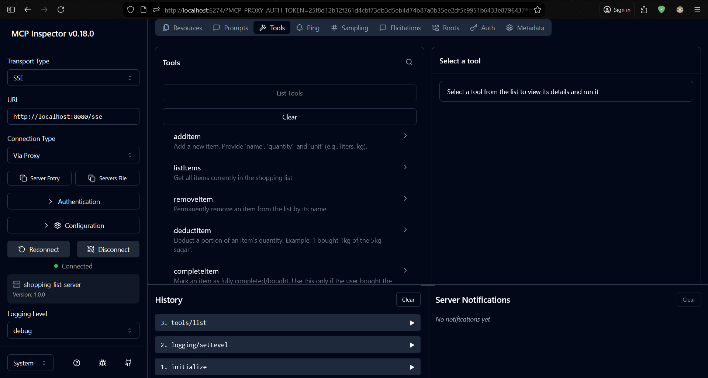
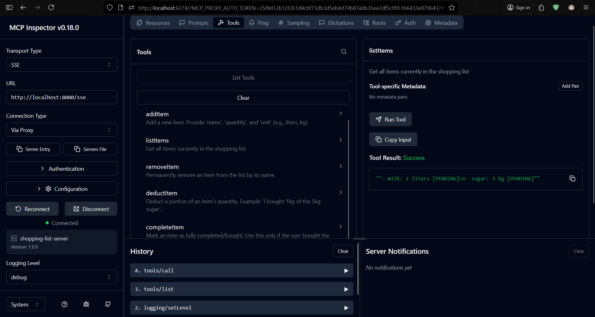
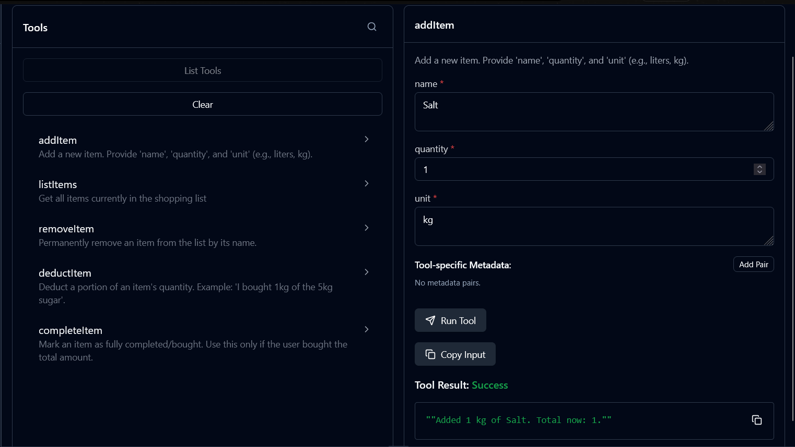
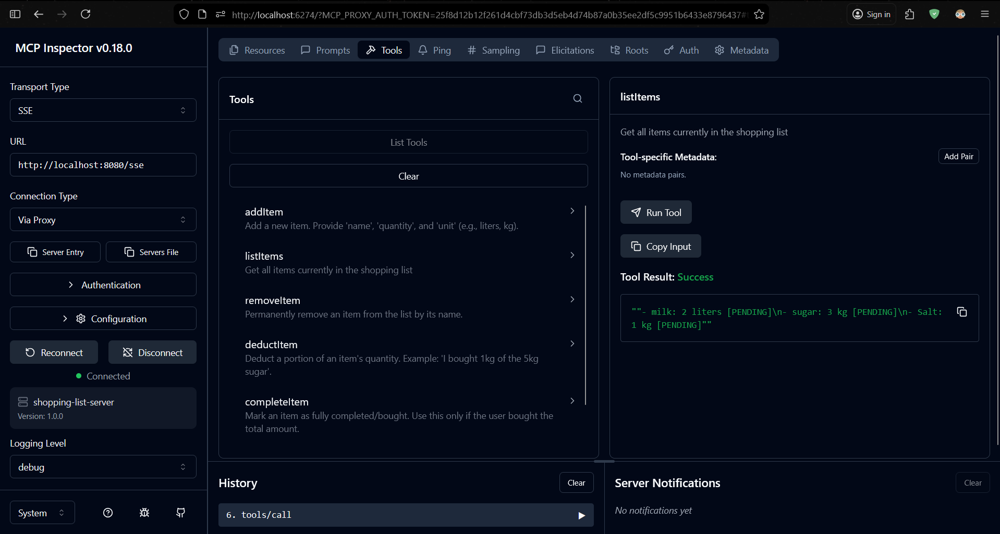
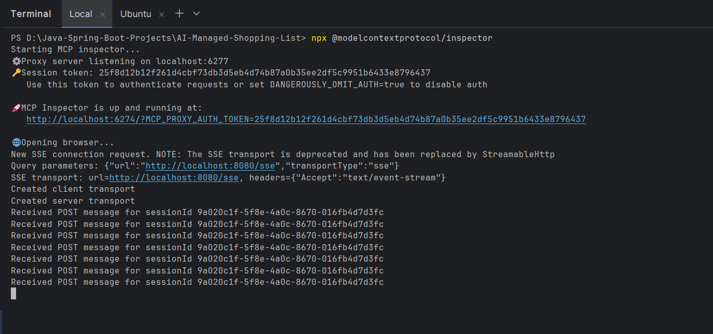

# 🛒 AI-Managed Shopping List (MCP & Groq Powered)

A production-grade, full-stack AI application that leverages the **Model Context Protocol (MCP)** to allow an LLM to manage a local PostgreSQL database via natural language. Built with a modern tech stack, it features a real-time dashboard and a specialized AI agent capable of complex entity extraction and partial inventory deductions.


---

## 🚀 Key Features

- **Natural Language Orchestration**: Add, remove, or list items using conversational English (e.g., "I bought 2kg of the 5kg sugar").
- **Agentic Reasoning**: Powered by **Groq (Llama 3.3)**, the system distinguishes between "completing" an item and "deducting" quantity.
- **Model Context Protocol (MCP)**: Implements the 2025 industry standard for connecting AI models to local data sources via SSE.
- **Real-time Inventory Dashboard**: A sleek **Midnight Black** UI built with React & Tailwind CSS v4, featuring auto-sync with the PostgreSQL backend.
- **Dockerized Architecture**: One-click deployment for the entire stack (Frontend, Backend, and Database).

---

## 📸 Screenshots

### 1. The Dashboard (Midnight Theme)
> 
> 
> 

---

### 2. MCP Inspector Debugging
> 
> 
> 
> 
> 

---

## 🛠 Tech Stack

- **Backend**: Java 21, Spring Boot 3.5, Spring AI, Spring Data JPA.
- **AI/LLM**: Groq Cloud (Llama 3.3-70b), Model Context Protocol (MCP).
- **Frontend**: React.js, Tailwind CSS v4, Lucide Icons, Axios.
- **Database**: PostgreSQL.
- **DevOps**: Docker, Docker Compose.

---

## 🚦 Getting Started

### Prerequisites
- Node.js 20+
- JDK 21+
- Docker & Docker Compose
- Groq API Key

### Option 1: Docker Deployment (Recommended)
1. Clone the repository.
    ```bash
    git clone <repo-url>
    ```
2. Create a `.env` file in the root.
    ```bash
    cp .env.example .env
    ```
Add your key: `GROQ_API_KEY=your_key_here` & postgres password: `POSTGRES_PASSWORD=your_secure_password`.

3. Run:
   ```bash
   docker-compose up --build
   ```
4. Access the UI at http://localhost:5173 and backend at http://localhost:8080.

### Option 2: Local Development
1. Clone the repository.
    ```bash
    git clone <repo-url>
    ```
2. **Backend:** Update `application.properties` with your local Postgres credentials and run `AiManagedShoppingListApplication`.
3. **Frontend:**
    ```bash
    cd shopping-list-mcp-client
    npm install
    npm run dev
    ```
4. Access the UI at http://localhost:5173 and backend at http://localhost:8080.

---

## 🤖 AI Tools (MCP)
The backend exposes the following tools to the AI:

- `addItem(name, quantity, unit)`: Adds or updates items.

- `listItems()`: Returns the current state of the inventory.

- `deductItem(name, amount)`: Handles partial purchases.

- `completeItem(name)`: Marks an item as fully bought.

- `clearCompleted()`: Bulk deletes finished tasks.

## 🔍 Debugging with MCP Inspector
The **MCP Inspector** is a specialized tool used to visualize the "handshake" between your Spring Boot server and the Model Context Protocol. It allows you to test your Java methods as if you were the AI model.

### 1. Launch the Inspector:
Ensure your Spring Boot backend is running on http://localhost:8080. Then, in a new terminal, run:
```bash
    npx @modelcontextprotocol/inspector
```
The inspector will typically open at http://localhost:6274.

### 2. Connect via SSE:
In the Inspector's browser window:
- Set Transport Type to `SSE`.
- Enter the URL: http://localhost:8080/sse.
- Click Connect.

### 3. Step-by-Step Tool Validation:
Once connected, follow these steps to verify your logic:

i) **Tool Discovery:** Go to the Tools tab. Click List Tools. You should see all 6 tools (addItem, listItems, deductItem, etc.) with their descriptions.

ii) **State Verification:** Select `addItem`. Enter the parameters:
- `name`: `Coffee`
- `quantity`: `2`
- `unit`: `packs`
- Click Run Tool.

iii) **Cross-Check:** Immediately run `listItems`. The output should now reflect the updated database state.

iv) **Logic Test:** Run `deductItem` with `name: Coffee` and `amount: 1`. Run `listItems` again to ensure the quantity dropped to `1`.

---